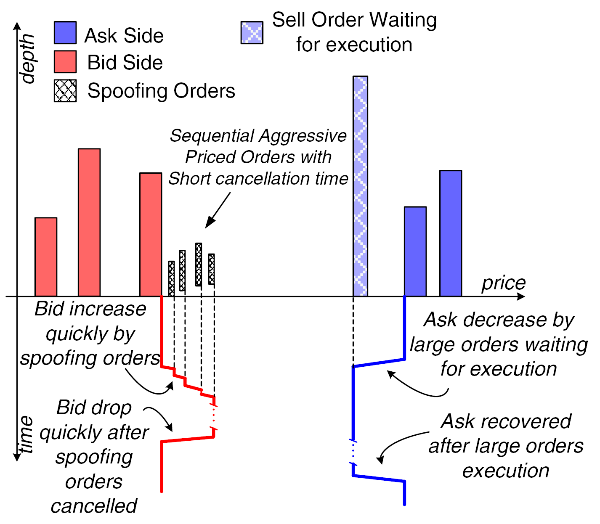
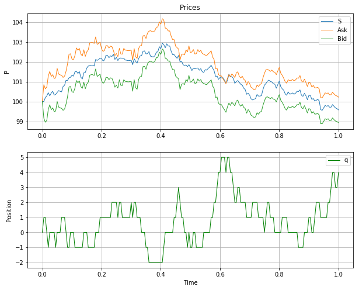

### Sample works - Naotaka Ikeda
### 1. Credit risk analysis
#### 1.1. Standard Merton Model (Nochu)
By accounting identity, $A(t)=D(t)+E(t)$ where denotes assets $A$, debt $D$, and equity $E$. Assume that the firms debt consists of $T$-maturity zero-coupon bonds with notional $D_F$. At time $T$, the debt holders evidently receive 
$$
D(T)=\min \left(D_{F}, A(T)\right)=A(T)-\left(A(T)-D_{F}\right)^{+} \quad \text{(short call)}
$$
The equity holders receive
$$
E(T)=\left(A(T)-D_{F}\right)^{+}=A(T)-D(T) \quad \text{(call option)}
$$
Finally, assume that the assets satisfy a simple risk-neutral diffusion $d A(t) / A(t)=r d t+\sigma_{A} d W(t)$. By Black-Scholes formula,
$$
\begin{aligned} E(0) &=A(0) \Phi\left(d_{+}\right)-D_{F} e^{-r T} \Phi\left(d_{-}\right) \\
D(0) &=A(0)-E(0) \end{aligned}
$$
where
$$
d_{ \pm} = \frac{\ln \left(A(0) / D_{F}\right)+\left(r \pm \frac{1}{2} \sigma_{A}^{2}\right) T}{\sigma_{A} \sqrt{T}}
$$
Given the equity $E$ and other parameters, we can calculate fair prices of assets and debts, and the survival probability of the firm.


```python
from numpy import *
from scipy.stats import norm
from scipy.optimize import fmin

def Merton(A, D, r, vol, T):
    d1 = (log(A/D) + (r + 0.5*vol**(2))*T)/(vol*sqrt(T))
    d2 = (log(A/D) + (r - 0.5*vol**(2))*T)/(vol*sqrt(T))
    return A * norm.cdf(d1) - D * exp(-r*T) * norm.cdf(d2)

def Merton_E(A, E, D, r, vol, T):
    return (Merton(A, D, r, vol, T) - E)**2

E, D, r, vol, T = 10, 10, 0.02, 0.275, 5
A = 10 # initial guess

A_esti = fmin(Merton_E, A, args=(E, D, r, vol, T), maxiter=10000, maxfun=10000, xtol=1e-6, disp=0)
print("A_esti:", A_esti) # 18.5882
print("E(check):",Merton(A_esti, D, r, vol, T)) # E = 10

d2_esti = (log(A_esti/D) + (r - 0.5*vol**(2))*T)/(vol*sqrt(T))
print("Survival prob.:", 1-norm.cdf(-d2_esti)) # 0.8060
```

    A_esti: [18.58824253]
    E(check): [9.99999988]
    Survival prob.: [0.80602372]
    

#### 1.2. Gaussian Model simulation (Euler method, NYU)
Simulate a stochastic default intensity $\lambda(t)$ in a simple one-factor Gaussian Model
$$
\begin{aligned} d x(t) &=(y(t)-\kappa x(t)) d t+\sigma(t) d W(t), \quad x(0)=0 \\ \lambda(t) &=\lambda_{f}(0, t)+x(t)
\end{aligned}
$$
Here we assume constant mean reversion $\kappa$ and constant volatility $\sigma$. One way to simulate the process $\lambda(t)$ is an Euler scheme, i.e.,
$$
x(t_{i+1})-x(t_{i})=\left(y(t_{i})-\kappa x(t_{i})\right) \Delta_{i}+\sigma Z_{i} \sqrt{\Delta_{i}}
$$
where $\Delta_{i} \triangleq t_{i+1}-t_{i}$ and the $\left\{Z_{i}\right\}$ are independent random draws from a Gaussian $N(0,1)$ distribution. Concretely, we can explicitly update each process from $t_i$ to $t_{i+1}$ as
$$
\begin{aligned}
y(t_{i}) &= \int_{0}^{t_i} \sigma^2 e^{2 \kappa(u-t_i)} d u = \frac{\sigma^2}{2\kappa}(1 - e^{-2\kappa t_i}) \\
x(t_{i+1}) &= x(t_{i}) + \left(y(t_{i})-\kappa x(t_{i})\right) \Delta_{i}+\sigma Z_{i} \sqrt{\Delta_{i}} \\
\lambda(t_{i+1}) &=a+b t_{i+1}+x(t_{i+1})
\end{aligned}
$$
Starting from $x(0) = 0$, we can iteratively work our way forward to create a path of $x(t)$ on the time grid.


```python
import matplotlib.pyplot as plt

# fixed parameters
T, a, b, k, sigma = 10.0, 0.015, 0.001, 0.04, 0.01
N = 252 # daily
dt = T / N

# Euler discretization
def path(N, dt):
    Xem = zeros(N)
    dW = sqrt(dt) * random.randn(N)
    dW[0] = 0
    Xtemp = 0
    for j in range(1, N):
        Xtemp += - k * Xtemp * dt + sigma * dW[j] # mean reversion, diffusion
        Xtemp += ((sigma**2 / (2*k)) * (1 - exp(-2*k*j*dt))) * dt # drift y
        Xem[j] = Xtemp
    return Xem

for i in range(10): # 10 sample paths
    plt.plot(arange(0.0, T, dt), a + b*arange(0.0, T, dt) + path(N, dt))
plt.title('Euler');
```


### 2. Limit Order Book (LOB) and Market Microstructure
#### 2.1. Visulalize spoofing (Summer 2019, CFTC)
- “Disruptive trading behaviours” was first proposed by CFTC; "bids or offers with intent to cancel the bid or offer before execution for violating the bid or offer prices with reckless disregard for the orderly execution or market integration".
- Example of a sequence of spoofing orders: with a bona fide large-sized sell order placed at an expected price on the ask side, a succession of manipulative buy orders, with quotes successively higher than the best bid price, were submitted to give the impression of active purchasing interest in that equity.




*Source: Zhai, Jia, Yi Cao, Yuan Yao, Xuemei Ding, and Yuhua Li. 2017. "Computational Intelligent Hybrid Model for Detecting Disruptive Trading Activity." Decision Support Systems 93: 26-41.

#### 2.2. Reintegrate optimal order placement approaches (Ongoing, NYU)
- Optimal order placement problem under the Almgren–Chriss model
 - Deciding market/limit order given order schedule 
 - Goal: $\min _{X} \mathbb{E}[v(X, \xi)]$ ($X$: allocation, $v$: cost func., $\xi$: orders)

(The Almgren–Chriss model)
Given asset price dynamics $S^X_t$, for two non-decreasing functions $g,h$ : $\mathbb{R} \rightarrow \mathbb{R}$ with $g(0) = 0 = h(0)$,
$$
S_{t}^{X}=S_{t}^{0}+\int_{0}^{t} g(\dot{X}_{s}) d s+h(\dot{X}_{t})
$$
Here, the term $h(\dot{X}_{t})$ corresponds to temporary price impact, while $\int_{0}^{t} g(\dot{X}_{s}) d s$ describes permanent price impact.

- This framework is useful, but still abstracts away microstructure details by assuming that a parent order is split into a sequence of child orders.
 - Cont and Kukanov (2017): fill the scheduled batch of orders by optimally distributing it across trading venues and order types
 - Benveniste and Ritter (2017): use the Hamiltonian dynamics, in which the generalized momenta $p=\delta L / \delta \dot{q}$ play the role of microstructure alphas ($\dot{q}$: trading rate, $L=c(v)+\frac{1}{2} \kappa\left(q-q_{\mathrm{opt}}\right)^{\prime} \Sigma\left(q-q_{\mathrm{opt}}\right)$: Lagrangian)

 - Avellaneda and Stoikov (2008): assume the market mid-price follows a log normal process with a reasonable spread between bid/ask and that market orders arrive according to a Poisson process
 

